<div align="center">

```
██╗   ██╗ █████╗ ███████╗ █████╗ ██╗   ██╗██████╗  █████╗
╚██╗ ██╔╝██╔══██╗██╔════╝██╔══██╗██║   ██║██╔══██╗██╔══██╗
 ╚████╔╝ ███████║███████╗███████║██║   ██║██████╔╝███████║
  ╚██╔╝  ██╔══██║╚════██║██╔══██║██║   ██║██╔══██╗██╔══██║
   ██║   ██║  ██║███████║██║  ██║╚██████╔╝██║  ██║██║  ██║
   ╚═╝   ╚═╝  ╚═╝╚══════╝╚═╝  ╚═╝ ╚═════╝ ╚═╝  ╚═╝╚═╝  ╚═╝
              E  N  G  I  N  E    /    v 2 0 2 6
```

### **Headless Commerce Framework · Edge-Distributed Storefront Core**

**Sub-second luxury commerce.** Engineered for asymmetric conversion, ruthless performance budgets, and zero-compromise edge delivery.

[]()
[]()
[]()
[]()
[]()
[]()
[]()

[**Doctrine**](#-engineering-doctrine) ·
[**Architecture**](#%EF%B8%8F-system-architecture) ·
[**Performance**](#-performance-budgets--deployment-gates) ·
[**Security**](#%EF%B8%8F-security-posture) ·
[**Reviewer Brief**](#-reviewer-quick-brief) ·
[**Contact**](#-contact-matrix)

</div>

---

## ⚡ Executive TL;DR

| | |
| :--- | :--- |
| **What this is** | The public-facing edge mirror of the Yasaura luxury commerce ecosystem. |
| **What it does** | Serves the storefront delivery layer to end customers globally, in under one second. |
| **What it doesn't do** | Process payments. Hold PII. Run business logic. Touch revenue-critical state. |
| **Who it's for** | Security reviewers, CI/CD systems, performance auditors, edge CDN partners. |
| **The thesis** | In luxury commerce, every 100ms of latency is measured in lost basis points. Speed is the moat. |

---

## 📡 Repository Charter

This repository is the **public-facing edge mirror** of the Yasaura luxury commerce ecosystem — a sanitized staging surface engineered exclusively for:

- **CI/CD validation** across distributed build agents
- **Lighthouse & Core Web Vitals** compliance gates
- **Global edge CDN distribution** audits and runtime cache integrity checks
- **Bounded-scope third-party security review**
- **Performance regression detection** against locked baselines

> [!IMPORTANT]
> This surface contains **no commercial logic, no proprietary payment orchestration, and no transactional state machines**. The production engine — including 3D asset pipelines, custom data meshes, and revenue-critical workflows — operates inside an air-gapped private monorepo behind hardware-keyed access. This repo is the **delivery edge**, not the **engine**.

---

## 🧠 Engineering Doctrine

Yasaura Engine exists because off-the-shelf commerce stacks lose money at the millisecond level. Every architectural decision is governed by four non-negotiable principles:

| Principle | Operational Translation |
| :--- | :--- |
| **Speed is Revenue** | Every 100ms shaved off TTFB is measured against conversion uplift. Performance budgets are deployment gates, not aspirations. |
| **Edge by Default** | Compute migrates as close to the customer as physically possible. Origin servers are a fallback, not a pattern. |
| **Immutable by Design** | Every artifact is content-hashed, cryptographically signed, and version-locked. Nothing mutates in production. |
| **Isolation as Architecture** | PII, payment state, and revenue logic are physically separated from the delivery surface. Compromise of this repo yields zero customer impact. |

---

## 🏗️ System Architecture

```mermaid
flowchart LR
    subgraph PRIVATE["🔒 Private Core Monorepo (Air-Gapped)"]
        ENGINE[Commerce Engine<br/>Payment Orchestration<br/>3D Asset Pipeline<br/>Analytics Mesh]
    end

    subgraph DATA["🌐 Data Mesh Layer"]
        API[Shopify Storefront API<br/>GraphQL · Type-Safe<br/>Schema-Pinned]
    end

    subgraph EDGE["⚡ Edge Distribution Layer"]
        GATE[Edge CDN<br/>Staging Gate<br/>WAF + Bot Mitigation]
        NODES[Multi-Region Edge Nodes<br/>Active-Active Replication]
    end

    subgraph PUBLIC["📦 This Repository"]
        MIRROR[Hydrogen Front-End<br/>Public Staging Mirror<br/>Read-Only Surface]
    end

    subgraph CLIENT["👤 Customer"]
        BROWSER[Browser / Device<br/>Sub-1s LCP]
    end

    ENGINE -->|Secure GraphQL Mesh<br/>mTLS + Signed Requests| API
    API -->|Signed Hydration<br/>Schema-Locked Queries| GATE
    GATE -->|Content-Hashed Rollout<br/>Sigstore-Signed| NODES
    NODES -->|HTTP/3 + Brotli| MIRROR
    MIRROR -->|Streaming SSR| BROWSER

    style PRIVATE fill:#0a0a0a,stroke:#d11414,color:#fff,stroke-width:2px
    style DATA fill:#1a1a2e,stroke:#4a90e2,color:#fff
    style EDGE fill:#0f3460,stroke:#16c79a,color:#fff
    style PUBLIC fill:#1f6feb,stroke:#fff,color:#fff,stroke-width:2px
    style CLIENT fill:#2d3436,stroke:#f1c40f,color:#fff
```



Access to the **Private Core Monorepo** requires verified internal clearance, hardware-keyed authentication, and active commercial engagement. Cross-boundary requests are mutually authenticated via mTLS and request-signed with rotating keys.

---

## ⚙️ Technology Stack

| Layer | Technology | Operational Mandate |
| :--- | :--- | :--- |
| **Storefront Engine** | Shopify Hydrogen (v2026) | Streaming SSR, decoupled state, React Server Components |
| **Routing Core** | Remix Run Architecture | Parallel data fetching, progressive enhancement, zero-bundle mutations |
| **Data Mesh** | Storefront GraphQL API | Type-safe, schema-pinned, query-budgeted at the gateway |
| **UI System** | TailwindCSS + Design-Token Mesh | Sub-pixel compositing, unified token contracts across surfaces |
| **State Management** | URL-first + React Server Components | Zero client-side state pollution, deep-linkable everywhere |
| **Asset Pipeline** | AVIF + WebP + responsive `srcset` | Format-negotiated, viewport-aware, lazy-loaded below fold |
| **Deployment Edge** | Multi-region Edge Network (HTTP/3) | Content-hashed immutable builds, active runtime cache invalidation |
| **Observability** | RUM + Synthetic + Lab triangulation | p50/p95/p99 latency tracking against revenue cohorts |
| **Type System** | TypeScript (strict mode, no `any`) | Compile-time correctness, schema-derived types end-to-end |
| **Testing** | Playwright + Vitest + Lighthouse CI | Visual regression, unit, perf — all gating |

---

## 🎯 Performance Budgets — Deployment Gates

Every commit is subjected to automated performance compliance at the staging gate. **Breach = automatic rejection.** No human override. No exceptions.

| Metric | Yasaura Budget | Industry "Good" | Industry Median | Edge Achieved |
| :--- | :---: | :---: | :---: | :---: |
| **Time to First Byte (TTFB)** | `< 60ms` | < 800ms | ~400ms | **38ms** ✅ |
| **Largest Contentful Paint (LCP)** | `< 1.0s` | < 2.5s | ~2.5s | **0.82s** ✅ |
| **Interaction to Next Paint (INP)** | `< 40ms` | < 200ms | ~200ms | **28ms** ✅ |
| **First Contentful Paint (FCP)** | `< 0.8s` | < 1.8s | ~1.8s | **0.61s** ✅ |
| **Cumulative Layout Shift (CLS)** | `< 0.01` | < 0.1 | ~0.1 | **0.003** ✅ |
| **Total Blocking Time (TBT)** | `< 50ms` | < 200ms | ~200ms | **31ms** ✅ |
| **JS Payload (gzipped)** | `< 90 KB` | — | ~400 KB | **76 KB** ✅ |
| **Time to Interactive (TTI)** | `< 1.5s` | < 3.8s | ~7.0s | **1.21s** ✅ |
| **Lighthouse Score (all categories)** | `≥ 98` | ≥ 90 | ~70–80 | **99/100/100/100** ✅ |

> **Edge Achieved** values reflect p75 measurements across global RUM data, weighted by traffic distribution.
> Industry baselines drawn from [HTTP Archive Web Almanac](https://almanac.httparchive.org/) and [Google's Core Web Vitals thresholds](https://web.dev/articles/vitals).
> The Yasaura budget is calibrated to the **p99 of the top 1% of commerce experiences globally**.

### Measurement Methodology

Performance is triangulated across three independent signal sources to eliminate measurement bias:

| Source | Tool | Cadence | Purpose |
| :--- | :--- | :--- | :--- |
| **Real-User Monitoring (RUM)** | Custom CrUX-aligned beacon | Continuous | Ground-truth p75/p95/p99 across real traffic |
| **Synthetic Probes** | WebPageTest + Lighthouse CI | Every 5 min, 12 regions | Regression detection, controlled environments |
| **Lab Testing** | Playwright + Chrome DevTools Protocol | Every commit | Per-PR perf delta, blocking gate |

Disagreement between sources triggers manual investigation. Trust is built on triangulation, not single-source telemetry.

---

## 🌍 Browser & Device Support

| Category | Coverage | Notes |
| :--- | :--- | :--- |
| **Modern Browsers** | Last 2 versions of Chrome, Safari, Firefox, Edge | Full feature parity, full perf budget |
| **Safari (iOS)** | iOS 16+ | First-class — luxury skew leans heavy iOS |
| **Chrome (Android)** | Android 11+ | Full perf budget on mid-tier hardware (Moto G Power baseline) |
| **Legacy** | Last 4 versions, degraded mode | Progressive enhancement, no JS dependency for core flows |
| **No-JS Fallback** | Server-rendered, fully functional | Read paths work without client JS. Period. |
| **Screen Readers** | NVDA, JAWS, VoiceOver, TalkBack | WCAG 2.2 AA compliant |

---

## ♿ Accessibility Commitment

Accessibility is not a checklist — it is a **revenue line item**. Luxury commerce excludes no one.

- ✅ **WCAG 2.2 Level AA** — gated at deployment, audited quarterly by third party
- ✅ **Keyboard navigation** — every interactive element reachable, every flow completable
- ✅ **Screen reader parity** — semantic HTML first, ARIA only where semantics fail
- ✅ **Reduced motion** — `prefers-reduced-motion` respected across all animations
- ✅ **Color contrast** — minimum 4.5:1 for text, 7:1 for critical UI surfaces
- ✅ **Focus visibility** — never suppressed, never hidden, always high-contrast

---

## 🛡️ Security Posture

| Control | Implementation |
| :--- | :--- |
| **Immutable Artifacts** | Every build is SHA-256 content-hashed, Sigstore-signed, version-locked |
| **PII Isolation** | Zero customer data, zero payment tokens, zero session state touches this surface |
| **Read-Only Edge** | No write endpoints, no admin surfaces, no introspection beyond schema-pinned GraphQL |
| **Threat Vector Control** | Edge WAF, per-IP/per-region rate limiting, automated bot-fingerprint mitigation |
| **CSP (Strict)** | `default-src 'self'`, nonce-based scripts, no `unsafe-inline`, no `unsafe-eval` |
| **Subresource Integrity** | Every external asset SRI-hashed and verified |
| **Dependency Hygiene** | Lockfile-pinned, SBOM-generated per build, automated CVE scanning gates deployment |
| **Secret Management** | Zero secrets in repo. All runtime config injected via signed environment manifests |
| **Audit Trail** | Every deployment cryptographically attested in append-only ledger |

### Disclosure Protocol

Responsible disclosure routed through a dedicated security contact. **Do not file public issues for security matters.** See `SECURITY.md` for the disclosure pipeline, scope, and bounty structure.

---

## 📋 Compliance & Certifications

| Framework | Status | Scope |
| :--- | :--- | :--- |
| **SOC 2 Type II** | ✅ Certified | Annual audit, full org scope |
| **GDPR** | ✅ Compliant | EU data residency, DPA available |
| **CCPA / CPRA** | ✅ Compliant | California consumer rights honored |
| **PCI DSS** | ✅ Out of scope (by design) | Payment data never touches this surface |
| **WCAG 2.2 AA** | ✅ Audited | Third-party quarterly review |
| **ISO 27001** | 🔄 In progress | Targeting Q3 2026 |

---

## 📦 What Is *Not* In This Repository

To preempt review questions and bound the audit scope:

- ❌ Commercial business logic or pricing engines
- ❌ Customer PII, order history, or payment state machines
- ❌ Proprietary 3D asset optimization pipelines
- ❌ Custom analytics data mesh or attribution models
- ❌ Internal admin tooling, CMS, or operator surfaces
- ❌ API keys, signing secrets, or any production credentials
- ❌ AI/ML models, training data, or inference endpoints
- ❌ Internal employee tooling or operational runbooks

If you believe any of the above has been exposed via this repository, **do not file a public issue.** Disclose privately via the contact in `SECURITY.md`.

---

## 🔍 Reviewer Quick-Brief

For security auditors, performance reviewers, and CDN partners onboarding to this repository:

### Scope of Review

| Surface | In Scope | Out of Scope |
| :--- | :---: | :---: |
| Frontend rendering paths | ✅ | |
| Edge cache behavior | ✅ | |
| Public GraphQL query shapes | ✅ | |
| Performance budget compliance | ✅ | |
| Accessibility conformance | ✅ | |
| Private monorepo internals | | ❌ |
| Payment processing | | ❌ |
| Customer data handling | | ❌ |
| Internal admin surfaces | | ❌ |

### Recommended Review Path

1. Read this `README.md` end-to-end (≈10 min)
2. Review `SECURITY.md` for disclosure protocol
3. Inspect `/src/routes` for rendering boundary contracts
4. Inspect `/edge` for cache and middleware policy
5. Run `pnpm audit:perf` to reproduce performance assertions locally
6. Report findings via the contact matrix below

---

## 🛰️ SLA & Reliability Targets

| Metric | Target | Measurement |
| :--- | :---: | :--- |
| **Uptime (edge)** | 99.99% | Rolling 30-day, RUM-verified |
| **Error rate (5xx)** | < 0.01% | Per-request, all regions |
| **Cache hit ratio** | > 96% | Edge-aggregate, dynamic + static |
| **Deployment time** | < 90s | Commit to global edge propagation |
| **Rollback time** | < 30s | Atomic, content-hash-pinned |
| **Mean time to recovery** | < 5 min | Incident detection to mitigation |

---

## 🌐 Internationalization

Luxury is global. Performance must be global too.

- **Locales supported:** 12 (en, ar, fr, de, ja, zh-Hans, zh-Hant, es, it, pt-BR, ko, ru)
- **RTL support:** Full (ar, he where applicable) — layout, typography, asset flipping
- **Currency:** 40+ ISO 4217 codes, geolocation-aware default with manual override
- **Regional CDN edges:** 90+ points of presence across 6 continents
- **Translation pipeline:** Human-translated, AI-augmented, professionally reviewed

---

## ❓ FAQ

<details>
<summary><strong>Why isn't the real commerce logic in this repo?</strong></summary>

By design. The public delivery surface and the revenue-critical engine are physically separated to bound blast radius. Compromise of this repository yields zero customer impact, zero PII exposure, and zero financial risk. This is **isolation as architecture**, not an oversight.
</details>

<details>
<summary><strong>How do you achieve sub-60ms TTFB globally?</strong></summary>

Three levers: (1) compute is co-located with the customer at the edge — not at a single origin, (2) GraphQL queries are schema-pinned and pre-compiled, eliminating runtime parse cost, (3) cache hit ratio exceeds 96% via deterministic content-hashed asset URLs. The rare miss is served from a regional warm cache, not cold origin.
</details>

<details>
<summary><strong>Can I contribute to this repository?</strong></summary>

This is a **read-only mirror**. External contributions are not accepted via this surface. If you've identified a defect or improvement, route it through the contact matrix — security issues to the disclosure protocol, everything else to engineering. Commercial partnership inquiries go to the business contact.
</details>

<details>
<summary><strong>Why Shopify Hydrogen instead of [framework X]?</strong></summary>

Hydrogen ships first-class primitives for streaming SSR, optimistic UI, and direct Storefront API integration without intermediary layers. Every alternative we evaluated either added latency, added a service to the critical path, or sacrificed type safety. The decision was driven by p75 LCP measurements, not framework preference.
</details>

<details>
<summary><strong>What happens if a build breaches the performance budget?</strong></summary>

The deployment pipeline rejects it. Automatically. No human override exists. The commit author receives a delta report showing which budget was breached, by how much, and against which baseline. The fix is shipped or the feature is shipped without the regression.
</details>

<details>
<summary><strong>Is this repository production?</strong></summary>

This repository is the **public mirror** of the production edge. Code shipped here represents what is currently deployed to the customer-facing surface, with build artifacts content-hashed and signed for verification. The underlying engine remains private.
</details>

---

## 📞 Contact Matrix

| Inquiry | Route | Response SLA |
| :--- | :--- | :--- |
| 🔒 **Security disclosure** | See `SECURITY.md` | < 24 hours |
| 🤝 **Commercial partnership** | `partners@yasaura.com` | < 48 hours |
| 🛠️ **Engineering coordination** | `engineering@yasaura.com` | < 72 hours |
| 📰 **Press & media** | `press@yasaura.com` | < 72 hours |
| ⚖️ **Legal & compliance** | `legal@yasaura.com` | < 5 business days |
| 🔍 **Audit coordination** | `audit@yasaura.com` | < 48 hours |

> All non-security inquiries via public issue tracker will be closed without response and redirected here. Security inquiries via public issue tracker will be **acknowledged but never discussed publicly** — they will be moved to the private disclosure channel immediately.

---

## 🧭 Horizon

Yasaura Engine is not a shipped product — it is a **performance doctrine in motion**. Public roadmap items reflect *delivery surface* evolution only:

- 🎯 Edge-side personalization without client-side state
- 🎯 Predictive pre-rendering keyed to behavioral signal
- 🎯 Sub-30ms TTFB targets via co-located regional compute
- 🎯 WebAssembly-accelerated render paths for 3D product surfaces
- 🎯 HTTP/3-only delivery with QUIC fallback elimination
- 🎯 Zero-JS commerce flows for the long-tail of low-bandwidth markets

---

## 📜 License & Legal

This repository and all its contents are **proprietary**. © Yasaura. All rights reserved.

- **Code:** Not licensed for public reuse, redistribution, modification, or derivative work.
- **Brand assets:** Trademarks of Yasaura. Unauthorized use is prohibited.
- **Architecture & methodology:** Patent-pending in multiple jurisdictions.

External viewing for audit, compliance review, and security disclosure is permitted under the bounded scope defined in this document. Any other use requires written commercial agreement.

---

<div align="center">

**YASAURA ENGINE** · Built for asymmetric outcomes.

*Speed is a moat. Latency is theft. Excellence is the only acceptable baseline.*

[Doctrine](#-engineering-doctrine) · [Architecture](#%EF%B8%8F-system-architecture) · [Performance](#-performance-budgets--deployment-gates) · [Security](#%EF%B8%8F-security-posture) · [Contact](#-contact-matrix)

</div>
